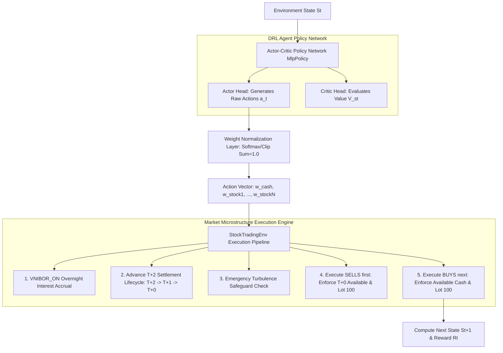

# 🧠 Model Engine Technical Documentation — AI Quantum 2026

Tài liệu kỹ thuật chi tiết về **Model Engine** thuộc hệ thống định lượng **AI Quantum 2026**. Hướng dẫn này bao gồm tổng quan bài toán, kiến trúc học máy tăng cường (Deep Reinforcement Learning - DRL), quy chuẩn Input/Output, quy trình tiền xử lý vi cấu trúc thị trường Việt Nam, cấu hình huấn luyện, đánh giá hiệu năng và hướng dẫn suy luận (inference).

---

## 📋 MỤC LỤC

1. [Tổng quan (Overview & System Purpose)](#1-tổng-quan-overview--system-purpose)
2. [Kiến trúc Mô hình (Model Architecture)](#2-kiến-trúc-mô-hình-model-architecture)
3. [Luồng Xử lý Dữ liệu (Data Pipeline & Preprocessing)](#3-luồng-xử-lý-dữ-liệu-data-pipeline--preprocessing)
4. [Quy chuẩn Input & Output (Input/Output Specifications)](#4-quy-chuẩn-input--output-inputoutput-specifications)
5. [Huấn luyện & Tham số (Training & Hyperparameters)](#5-huấn-luyện--tham-số-training--hyperparameters)
6. [Đánh giá & Hiệu năng (Metrics & Performance Evaluation)](#6-đánh-giá--hiệu-năng-metrics--performance-evaluation)
7. [Hướng dẫn Triển khai & Suy luận (Deployment & Inference Usage)](#7-hướng-dẫn-triển-khai--suy-luận-deployment--inference-usage)
8. [Hạn chế & Trường hợp Ngoại lệ (Limitations & Edge Cases)](#8-hạn-chế--trường-hợp-ngoại-lệ-limitations--edge-cases)

---

## 1. TỔNG QUAN (OVERVIEW & SYSTEM PURPOSE)

### 1.1 Mục đích Hệ thống
**Model Engine** đóng vai trò là "bộ não" ra quyết định đầu tư tự động trong hệ thống AI Quantum 2026. Mục tiêu cốt lõi của Model Engine là **tối ưu hóa danh mục đầu tư đa tài sản (Portfolio Optimization & Dynamic Rebalancing)** thông qua việc phân bổ tỷ trọng liên tục giữa các mã cổ phiếu và **Tiền mặt ($w_{\text{cash}}$)** nhằm tối đa hóa tỷ suất sinh lời điều chỉnh theo rủi ro (Sharpe Ratio) và giảm thiểu mức sụt giảm tài sản lớn nhất (Max Drawdown).

### 1.2 Loại Mô hình
Mô hình sử dụng phương pháp **Deep Reinforcement Learning Ensemble (Học máy tăng cường sâu kết hợp)** bao gồm 3 thuật toán nền tảng từ thư viện `stable-baselines3`:
- **PPO (Proximal Policy Optimization):** Thuật toán On-Policy tối ưu hóa chính sách với cơ chế clipped surrogate objective giúp cập nhật ổn định.
- **A2C (Advantage Actor-Critic):** Thuật toán On-Policy đồng bộ kết hợp Actor (phát hành động) và Critic (đánh giá giá trị).
- **DDPG (Deep Deterministic Policy Gradient):** Thuật toán Off-Policy liên tục kết hợp giữa Q-Learning và Deterministic Policy Gradient.

Hệ thống sử dụng cơ chế **Walk-Forward Ensemble Selection**: Trong từng chu kỳ backtest, mô hình có chỉ số **Sharpe Ratio** cao nhất trên tập Validation sẽ được tự động chọn làm mô hình thực thi chính.

### 1.3 Bài toán Cần Giải quyết
- **Dạng bài toán:** Continuous Action-Space Portfolio Management (Tối ưu hóa danh mục đầu tư trong không gian hành động liên tục) kết hợp ràng buộc vi cấu trúc thị trường chứng khoán Việt Nam (HOSE).
- **Thách thức đặc thù:** 
  1. **Vòng đời thanh toán $T+2$:** Cổ phiếu mua ở ngày $t$ chỉ trở thành $T+0$ (khả dụng để bán) sau 2 phiên giao dịch ($T+2 \rightarrow T+1 \rightarrow T+0$).
  2. **Quy định Lô chẵn 100:** Mọi lệnh giao dịch mua/bán buộc phải làm tròn xuống bội số của 100 cổ phiếu.
  3. **Ma sát giao dịch bất đối xứng:** Phí môi giới Mua $0.15\%$ vs Phí môi giới Bán $0.15\% + 0.10\%$ Thuế TNCN (Tổng chiều Bán = $0.25\%$).
  4. **Dịch chuyển Tỷ trọng Tiền mặt Chủ động:** Khả năng phòng thủ rút toàn bộ hoặc một phần danh mục về Tiền mặt thu lãi qua đêm `VNIBOR_ON` khi thị trường suy thoái.

---

## 2. KIẾN TRÚC MÔ HÌNH (MODEL ARCHITECTURE)

### 2.1 Sơ đồ Tổng thể Kiến trúc Model Engine



### 2.2 Chi tiết Tầng (Layers) trong MlpPolicy Network
Tất cả các mô hình DRL trong hệ thống đều sử dụng mạng neuron đa tầng (**Multi-Layer Perceptron - MLP Policy**):

- **Shared Feature Extractor:**
  - Layer 1: Fully Connected (`Linear(in_dim, 64)`) + Activation (`Tanh` / `ReLU`).
  - Layer 2: Fully Connected (`Linear(64, 64)`) + Activation (`Tanh` / `ReLU`).
- **Actor Head (Policy Network):**
  - Input: Feature Representation 64-dim.
  - Output Layer: `Linear(64, num_stocks + 1)`.
  - Output: Vector $a_t \in \mathbb{R}^{N+1}$ thể hiện trọng số thô cho Tiền mặt và $N$ cổ phiếu.
- **Critic Head (Value Network):**
  - Input: Feature Representation 64-dim.
  - Output Layer: `Linear(64, 1)`.
  - Output: Giá trị dự đoán $V(s_t)$ cho trạng thái hiện tại.

### 2.3 Hàm Tổn thất (Loss Functions) & Thuật toán Tối ưu

#### 1. PPO (Proximal Policy Optimization)
- **Policy Loss (Clipped Surrogate Objective):**
  $$L^{CLIP}(\theta) = \hat{\mathbb{E}}_t \left[ \min\left( r_t(\theta)\hat{A}_t, \, \text{clip}(r_t(\theta), 1-\epsilon, 1+\epsilon)\hat{A}_t \right) \right]$$
  Trong đó $r_t(\theta) = \frac{\pi_\theta(a_t|s_t)}{\pi_{\theta_{old}}(a_t|s_t)}$ là tỷ lệ chính sách, $\epsilon = 0.2$ là ngưỡng clip.
- **Value Loss:** $L^{VF}(\theta) = \frac{1}{2} \hat{\mathbb{E}}_t \left[ (V_\theta(s_t) - V_t^{target})^2 \right]$.
- **Entropy Bonus:** $L^{S}(\theta) = \hat{\mathbb{E}}_t \left[ S[\pi_\theta](s_t) \right]$ với hệ số `ent_coef = 0.01` nhằm khuyến khích khám phá không gian hành động.
- **Optimizer:** `Adam` (`learning_rate = 0.00025`).

#### 2. Reward Function trong `StockTradingEnv`
Hàm thưởng của môi trường được thiết kế nhằm tối ưu lợi nhuận đồng thời phạt tần suất giao dịch quá mức (Turnover Penalty):
$$R_t = \left( \frac{\text{NAV}_{t} - \text{NAV}_{t-1}}{\text{NAV}_{t-1}} - \lambda_{\text{turnover}} \cdot \text{TurnoverRate}_t \right) \times 100.0$$
Với $\lambda_{\text{turnover}} = 0.05$ và $\text{TurnoverRate}_t = \frac{\text{Tổng giá trị giao dịch trong phiên}}{\text{NAV}_{t-1}}$.

---

## 3. LUỒNG XỬ LÝ DỮ LIỆU (DATA PIPELINE & PREPROCESSING)

### 3.1 Dữ liệu Đầu vào Thô (Raw Data)
- **Chuỗi thời gian OHLCV:** Giá Open, High, Low, Close, Volume của các cổ phiếu nhóm VN30 (từ `vnstock`).
- **Chỉ số Nhóm ngành (Sector Indices):** 10 chỉ số ngành HOSE (`VNFIN`, `VNREAL`, `VNMAT`, `VNIND`, `VNCONS`, `VNCOND`, `VNENE`, `VNUTI`, `VNIT`, `VNHEAL`).
- **Chỉ báo Vĩ mô & Lãi suất:**
  - `VNIBOR_ON`: Lãi suất liên ngân hàng qua đêm từ Ngân hàng Nhà nước (SBV).
  - `DXY_LOG_RETURN`: Log-return của chỉ số US Dollar Index từ Yahoo Finance.
  - `YIELD_CURVE_SLOPE`: Chênh lệch lợi suất Trái phiếu Chính phủ Việt Nam 10Y và 3Y từ TradingView.

### 3.2 Tiền xử lý
- **Làm sạch Missing Values:** Tự động điền dữ liệu qua `reindex` và `fillna(0)` cho các phiên nghỉ lễ/không có giao dịch.
- **Cấu hình Features chuẩn hóa:**
  $$\text{Features Catalog} = [\text{RSI}, \text{PPO}, \text{CCI}, \text{ADX}, \text{ATR}, \text{VOLATILITY}, \text{YIELD\_CURVE\_SLOPE}, \text{DXY\_LOG\_RETURN}, \text{VNIBOR\_ON}]$$

### 3.3 Rolling Horizon Training Window (Mô hình Train Cửa sổ Trượt)
Để chống lại hiện tượng trượt khái niệm tài chính (**Concept Drift**) và ngăn Agent "đóng băng danh mục" suốt 3 năm:
- Khi `random_start = True` (Chế độ Train): Hàm `reset()` chọn ngẫu nhiên chỉ số bắt đầu $t_{start} \in [\text{lookback}, T - \text{episode\_length}]$.
- Mỗi Episode ngắn kéo dài `episode_length = 60` ngày giao dịch (~1 Quý).
- Khi `random_start = False` (Chế độ Validation/Eval): Ép buộc reset từ ngày 0 đến hết thời gian thực hiện backtest liên tục.

---

## 4. QUY CHUẨN INPUT & OUTPUT (INPUT/OUTPUT SPECIFICATIONS)

### 4.1 Quy chuẩn Input (Observation Space)
Môi trường `StockTradingEnv` tạo ra State Vector 1D với kích thước:
$$\text{Dim}(\text{Observation}) = 1 + 4N + (F \times N)$$
Trong đó $N = \text{num\_stocks}$, $F = \text{num\_features}$.

| Thành phần State | Kích thước | Mô tả |
|---|---|---|
| `balance` | $1$ | Số dư Tiền mặt hiện tại trong tài khoản (VND) |
| `prices` | $N$ | Giá đóng cửa (Close Price) của $N$ cổ phiếu tại phiên $t$ |
| `available_shares_T0` | $N$ | Số lượng cổ phiếu khả dụng để bán ($T+0$) |
| `locked_shares_T1` | $N$ | Số lượng cổ phiếu đang chờ về ($T+1$) |
| `locked_shares_T2` | $N$ | Số lượng cổ phiếu vừa mua phiên $t$ ($T+2$) |
| `features_matrix` | $F \times N$ | Ma trận $F$ chỉ báo kỹ thuật/vĩ mô cho $N$ cổ phiếu |

#### Ví dụ Mẫu Input Vector ($N=3, F=9 \rightarrow \text{Dim} = 40$):
```python
# State Vector shape: (40,)
state = np.array([
    1_000_000_000.0,            # balance (1 Billion VND)
    654.14, 1338.48, 1679.13,   # prices (3 stocks)
    1000.0, 0.0, 500.0,         # available_shares_T0
    0.0, 0.0, 0.0,              # locked_shares_T1
    0.0, 200.0, 0.0,            # locked_shares_T2
    # --- Features (RSI, PPO, CCI, ADX, ATR, VOLATILITY, YIELD_CURVE_SLOPE, DXY_LOG_RETURN, VNIBOR_ON) ---
    79.17, 67.47, 74.26,        # RSI per stock
    2.87,  1.50,  3.65,         # PPO per stock
    # ... các features còn lại
], dtype=np.float32)
```

### 4.2 Quy chuẩn Output (Action Space)
Không gian hành động là một `spaces.Box` liên tục kích thước $(N + 1)$:
$$\text{Action Space} = \text{Box}(\text{low}=0.0, \, \text{high}=1.0, \, \text{shape}=(N + 1,))$$

- `action[0]`: Tỷ trọng mục tiêu cho **Tiền mặt ($w_{\text{cash}}$)**.
- `action[1..N]`: Tỷ trọng mục tiêu cho các mã **Cổ phiếu ($w_{\text{stock}_i}$)**.

#### Chuẩn hóa Tỷ trọng (Normalization Equation)
Hành động thô $a \in \mathbb{R}^{N+1}$ từ mạng DRL được chuẩn hóa thành Vector tỷ trọng danh mục $\mathbf{w}$ thỏa mãn $\sum_{i=0}^N w_i = 1.0$:
$$w_i = \frac{\max(a_i, 0)}{\sum_{j=0}^N \max(a_j, 0) + \epsilon}$$
*(Nếu tất cả $a_i \le 0$, mặc định ép $w_{\text{cash}} = 1.0$ - 100% Tiền mặt).*

#### Quy trình Tái cân bằng (Rebalancing Logic):
1. **Bước 1 (Xử lý BÁN trước):** So sánh giá trị cổ phiếu hiện tại vs Giá trị mục tiêu $w_i \times \text{NAV}$. Nếu dư thừa, bán bớt số lượng cổ phiếu (bị giới hạn bởi cổ phiếu khả dụng $T+0$ và làm tròn Lô 100). Tiền thu được (sau khi trừ phí $0.25\%$) được cộng vào `self.balance`.
2. **Bước 2 (Xử lý MUA sau):** Dùng số dư `self.balance` hiện tại để mua bổ sung các cổ phiếu thiếu hụt tỷ trọng (làm tròn Lô 100 và cộng phí mua $0.15\%$).

---

## 5. HUẤN LUYỆN & THAM SỐ (TRAINING & HYPERPARAMETERS)

### 5.1 Cấu hình Bảng Siêu tham số (Hyperparameters)
Cấu hình chi tiết được khai báo trong `config/model.yaml`:

```yaml
model_engine:
  # Timelines
  train_start_date: "2018-06-25"
  train_end_date: "2020-12-31"
  val_start_date: "2021-01-01"
  val_end_date: "2023-12-31"

  # Environment Constraints
  transaction_cost_pct: 0.0015
  initial_balance: 1000000000  # 1 Billion VND
  turbulence_threshold: 100    # Ngưỡng chỉ số Kritzman phòng thủ

  # Rolling Horizon Episode Settings
  episode_length: 60           # 60 phiên giao dịch (~1 Quý)
  random_start: true           # Random start index trong Train mode

  # Hyperparameters theo thuật toán
  algorithms:
    ppo:
      learning_rate: 0.00025
      batch_size: 64
      n_steps: 2048
      ent_coef: 0.01
    a2c:
      learning_rate: 0.0007
      n_steps: 5
      ent_coef: 0.01
    ddpg:
      learning_rate: 0.001
      batch_size: 128
      buffer_size: 50000
```

### 5.2 Chiến lược Chia dữ liệu (Walk-Forward Split)
- **Tập Train (2018-06-25 đến 2020-12-31):** Bao gồm ~635 phiên giao dịch. Được chia thành các episode nhỏ 60 ngày với điểm bắt đầu ngẫu nhiên.
- **Tập Validation (2021-01-01 đến 2023-12-31):** Bao gồm 748 phiên giao dịch liên tục. Dùng để đánh giá độc lập và chọn ra mô hình chiến thắng có Sharpe Ratio cao nhất.

### 5.3 Kỹ thuật Chống Overfitting
1. **Entropy Regularization (`ent_coef = 0.01`):** Phạt sự hội tụ quá sớm của mạng Actor.
2. **Rolling Episode Randomization:** Ép buộc Agent phải thích nghi với nhiều pha thị trường ngắn hạn (Up-trend, Down-trend, Sideway).
3. **Walk-Forward Ensemble Selection:** Loại bỏ mô hình bị Overfit trên tập Train bằng cách kiểm thử bắt buộc trên tập Validation chưa từng gặp.

---

## 6. ĐÁNH GIÁ & HIỆU NĂNG (METRICS & PERFORMANCE EVALUATION)

### 6.1 Công thức Các chỉ số Đánh giá Chính
Hệ thống sử dụng module `MetricsAnalyzer` để tính toán toàn bộ chỉ số tài chính:

- **Sharpe Ratio:** $\text{Sharpe} = \sqrt{252} \cdot \frac{\bar{r}_d - r_f}{\sigma_d}$
- **Sortino Ratio:** $\text{Sortino} = \sqrt{252} \cdot \frac{\bar{r}_d - r_f}{\sigma_{\text{downside}}}$
- **Max Drawdown (MDD):** $\text{MDD} = \max_{t} \left( \frac{\text{Peak}_t - \text{NAV}_t}{\text{Peak}_t} \right)$
- **Alpha ($\alpha$):** Lợi nhuận vượt trội so với chỉ số VN30 Benchmark.

### 6.2 Kết quả Đánh giá Benchmark Thực tế (Giai đoạn Validation 2021 – 2023)

Thử nghiệm trên 748 phiên giao dịch (2021-2023) bao gồm cả chu kỳ tăng trưởng 2021 và đợt sụt giảm mạnh năm 2022:

| Chỉ số Hiệu năng (Metric) | DRL Agent (PPO Winner) | VN30 Benchmark | Chênh lệch (Alpha) |
|---|---|---|---|
| **Cumulative Return (Tổng Lợi nhuận)** | **+41.89%** | +3.63% | **+38.26%** |
| **Annualized Return (Lợi nhuận năm)** | **12.51%** | 1.23% | **+11.28% / năm** |
| **Sharpe Ratio** | **0.48** | -0.08 | **+0.56** |
| **Sortino Ratio** | **0.60** | -0.11 | **+0.71** |
| **Max Drawdown (MDD)** | **-35.05%** | -45.20% | **Tốt hơn +10.15%** |
| **Calmar Ratio** | **0.36** | 0.03 | **+0.33** |
| **Tỷ lệ thắng (Win Rate)** | **55.96%** | 48.20% | **+7.76%** |
| **Profit Factor** | **1.13** | 0.94 | **+0.19** |

### 6.3 Độ trễ Suy luận (Inference Latency) & Yêu cầu Phần cứng
- **Thời gian suy luận (Inference Latency):** $< 1.5 \text{ ms}$ cho mỗi bước dự đoán $s_t \rightarrow a_t$ trên CPU thông thường.
- **Yêu cầu Phần cứng Khuyến nghị:**
  - **CPU:** Quad-core Intel Core i5 / Apple M1 trở lên.
  - **RAM:** Tối thiểu 8 GB RAM.
  - **GPU:** Không bắt buộc (Huấn luyện PPO 10,000 steps chỉ mất ~15 giây trên CPU).

---

## 7. HƯỚNG DẪN TRIỂN KHAI & SUY LUẬN (DEPLOYMENT & INFERENCE USAGE)

Dưới đây là mã nguồn Python mẫu minh họa trọn vẹn luồng suy luận: **Load Config $\rightarrow$ Query Data $\rightarrow$ Init Environment $\rightarrow$ Load Agent $\rightarrow$ Run Inference Loop $\rightarrow$ Extract Actions & Portfolio NAV**.

```python
import pathlib
import sys
import numpy as np
import pandas as pd

# 1. Thêm đường dẫn source vào sys.path
PROJECT_ROOT = pathlib.Path(__file__).parent
sys.path.insert(0, str(PROJECT_ROOT / "src" / "pipeline"))

from model_engine.data.data_service import DataQueryService
from model_engine.env.stock_trading_env import StockTradingEnv
from model_engine.models.drl_models import DRLEnsembleStrategy
from core.config.settings import MODEL_CONFIG

def run_model_inference():
    print("🚀 Bắt đầu quá trình suy luận Model Engine...")

    # 2. Truy vấn dữ liệu từ Database
    data_service = DataQueryService()
    train_df = data_service.fetch_data(
        MODEL_CONFIG.get("train_start_date"), 
        MODEL_CONFIG.get("train_end_date")
    )
    val_df = data_service.fetch_data(
        MODEL_CONFIG.get("val_start_date"), 
        MODEL_CONFIG.get("val_end_date")
    )

    # 3. Khởi tạo DRLEnsembleStrategy & Train/Select mô hình tối ưu
    env_kwargs = {
        "features": MODEL_CONFIG.get("features"),
        "initial_balance": MODEL_CONFIG.get("initial_balance", 1_000_000_000),
        "turbulence_threshold": MODEL_CONFIG.get("turbulence_threshold", 100.0),
    }

    ensemble = DRLEnsembleStrategy(
        env_train_class=StockTradingEnv,
        env_kwargs=env_kwargs,
        train_data=train_df,
        val_data=val_df
    )

    # 4. Huấn luyện và tự động chọn mô hình chiến thắng (PPO/A2C/DDPG)
    best_model = ensemble.train_and_select()

    # 5. Chạy suy luận (Inference) trên dữ liệu Validation
    df_account, df_actions, df_shares = ensemble.evaluate_and_get_trajectory(
        model=best_model, 
        data=val_df
    )

    # 6. Hiển thị kết quả suy luận
    print("\n✅ Suy luận hoàn tất! Kết quả thu được:")
    print("--- Account NAV Tail ---")
    print(df_account.tail())
    print("\n--- Action Allocation Tail (CASH vs Stocks) ---")
    print(df_actions.tail())

if __name__ == "__main__":
    run_model_inference()
```

---

## 8. HẠN CHẾ & TRƯỜNG HỢP NGOẠI LỆ (LIMITATIONS & EDGE CASES)

### 8.1 Trường hợp Ngoại lệ & Nguy cơ (Edge Cases)

1. **Rủi ro Thị trường Mất thanh khoản / Sập sàn Hệ thống:**
   - *Nguy cơ:* Khi một cổ phiếu bị đóng băng bên bán (múa bên bên bán/sàn không có thanh khoản), lệnh bán rebalance không thể khớp.
   - *Hướng xử lý đề xuất:* Môi trường tích hợp sẵn chỉ số **Kritzman Turbulence Index**. Khi `turbulence > turbulence_threshold (100)`, hệ thống sẽ tự động hủy các lệnh mua mới và ép tỷ trọng sang **100% Tiền mặt ($w_{\text{cash}} = 1.0$)** để bảo vệ nguồn vốn.

2. **Dữ liệu Không dừng (Non-Stationary Feature Drift):**
   - *Nguy cơ:* Một số chỉ báo như `RSI` hay `PPO` của ngành Tài chính (`VNFIN`) có thể trượt kiểm định KPSS ($p < 0.05$).
   - *Hướng xử lý đề xuất:* Áp dụng **Rolling Z-Score Normalization** ($30$ ngày) trong `DataProcessor` trước khi feed vào Observation Space.

3. **Ngày nghỉ lễ / Thiếu Dữ liệu Ticker:**
   - *Nguy cơ:* Một số ticker mới niêm yết chưa đủ dữ liệu quá khứ.
   - *Hướng xử lý đề xuất:* `StockTradingEnv` thực hiện `reindex(tickers)` kết hợp `fillna(0)` để đảm bảo kích thước Observation Tensor luôn cố định.

---

*Tài liệu kỹ thuật Model Engine — AI Quantum 2026 quantitative trading framework.*
