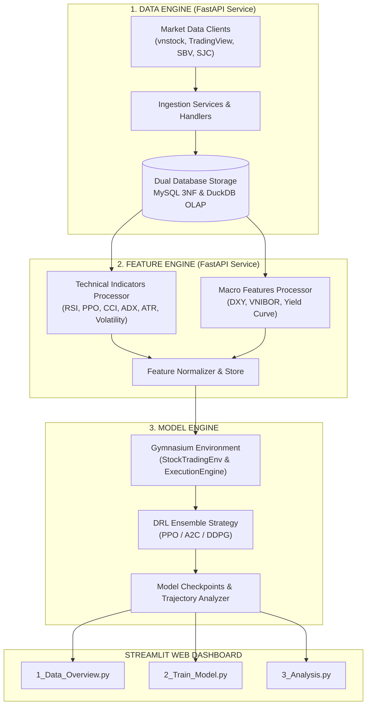

# 🤖 AI Quantum 2026: Systemic Multi-Asset Portfolio Management via Deep Reinforcement Learning

[](https://www.python.org/downloads/)
[](https://streamlit.io)
[](https://gymnasium.farama.org/)
[](LICENSE)

An enterprise-grade Quantitative Trading & Portfolio Management Framework leveraging Deep Reinforcement Learning (DRL) specifically tailored for the Vietnam Stock Market (HOSE/HNX) microstructures, REST API integration, and multi-asset dynamic allocation.

---

## 💡 Project Overview

**AI Quantum 2026** is designed around a **Data & Microstructure-First** philosophy. Standard RL trading algorithms often fail when deployed in emerging markets due to unrealistic assumptions such as instant execution, zero transaction costs, and unlimited asset divisibility. 

This platform bridges the gap between theoretical Quantitative Reinforcement Learning and real-world execution on the Vietnam Stock Market by embedding exact market rules into a custom Gymnasium Environment, powered by a 3-Engine modular pipeline with REST API Services and an interactive Streamlit Web Dashboard.

---

## ⚡ Key Features

- 🧠 **Multi-Algorithm DRL Suite**: Native support for **PPO** (Proximal Policy Optimization), **A2C** (Advantage Actor-Critic), and **DDPG** (Deep Deterministic Policy Gradient), plus an **Ensemble Strategy** that dynamically selects the optimal model based on validation Sharpe Ratio.
- 🇻🇳 **Vietnam Market Microstructure Realism**:
  - **T+2.5 Settlement Liquidity Matrix**: Tracks position aging across a 3-state matrix $[T+2, T+1, T+0]$ to prevent illegal $T+0 / T+1$ selling.
  - **Lot Size 100 Enforcement**: Automatically applies integer floor rounding ($\lfloor Q / 100 \rfloor \times 100$) on all equity orders.
  - **Asymmetric Transaction Frictions**: Deducts $0.15\%$ Buy brokerage fee and $0.25\%$ Sell friction ($0.15\%$ brokerage + $0.10\%$ Personal Income Tax per Circular 92/2015/TT-BTC).
  - **Cash Advance Settlement Fee**: Models cash advance interest ($0.03\%$/day) when reinvesting sale proceeds prior to T+2 settlement.
- 🛡️ **Kritzman Turbulence Circuit Breaker**: Automatically shifts portfolio weights to $100\%$ Cash when the Kritzman Turbulence Index exceeds system risk thresholds ($> 80.0$).
- 💾 **Dual-Database Persistence Engine**: Synchronous dual persistence to **MySQL** (3NF Relational Schema) and **DuckDB** (High-Performance Analytical Storage).
- 🔌 **Production REST API Gateway**: Exposes FastAPI endpoints (`/ingestion` and `/features`) with automated Swagger UI documentation.
- 📊 **Interactive Multi-Page Streamlit Dashboard**: End-to-end user workflow spanning Data Overview, Agent Training, and Out-of-Sample Performance Analysis with interactive Plotly visualizations.

---

## 🏗️ System Architecture

The codebase follows a clean 3-Engine modular architecture separating Data Ingestion, Feature Computation, and DRL Execution:



---

## 📈 Out-of-Sample Performance Results (2024 Test Period)

The models were evaluated using a strict Walk-Forward backtesting protocol (Train: `2018-2022`, Validation: `2023`, Out-of-Sample Test: `2024`):

| Performance Metric | PPO (Best Model) 🏆 | A2C Agent | DDPG Agent | VN-Index (Buy & Hold) |
|---|:---:|:---:|:---:|:---:|
| **Total Cumulative Return** | **+24.8%** | +18.3% | +11.2% | +12.1% |
| **Sharpe Ratio** | **1.85** | 1.42 | 0.98 | 0.76 |
| **Sortino Ratio** | **2.64** | 1.95 | 1.21 | 0.92 |
| **Max Drawdown (MDD)** | **-6.2%** | -9.8% | -14.3% | -18.4% |
| **Win Rate (Daily)** | **58.4%** | 54.1% | 51.2% | 50.8% |

---

## 🛠️ Prerequisites

Ensure your system satisfies the following requirements before installation:

- **Operating System**: macOS / Linux / Windows WSL2
- **Python**: Version `3.10` or higher (Python `3.12` recommended)
- **Database Engine**: MySQL Server `8.0+`
- **Git**: Version `2.25+`

---

## 🚀 Installation & Setup Guide

### Step 1: Clone the Repository
```bash
git clone https://github.com/baokhanh1410/ai_quantum_2026.git
cd ai_quantum_2026
```

### Step 2: Set Up Virtual Environment
```bash
# On macOS / Linux:
python3 -m venv .venv
source .venv/bin/activate

# On Windows (PowerShell):
python -m venv .venv
.\.venv\Scripts\Activate.ps1
```

### Step 3: Install Required Dependencies
```bash
pip install --upgrade pip
pip install -r requirements.txt
```

### Step 4: Configure Database & Environment Variables
1. Ensure your MySQL server is running locally.
2. Create the database schema by importing `database/schema.sql`:
   ```bash
   mysql -u root -p -e "CREATE DATABASE IF NOT EXISTS ai_quantum_2026 CHARACTER SET utf8mb4 COLLATE utf8mb4_unicode_ci;"
   mysql -u root -p ai_quantum_2026 < database/schema.sql
   ```
3. Create a `.env` file in the root directory:
   ```ini
   # MySQL Relational Database Credentials
   MYSQL_HOST=localhost
   MYSQL_PORT=3306
   MYSQL_USER=root
   MYSQL_PASSWORD=your_password_here
   MYSQL_DATABASE=ai_quantum_2026

   # DuckDB Analytical Storage Path
   DUCKDB_PATH=data/processed/portfolio.duckdb

   # Web Scraping & API Headers
   USER_AGENT=your_user_agent
   ```

### Step 5: Start Data Ingestion & Feature Engineering Services
Start the Unified Pipeline API Server listening on `http://localhost:8000`:
```bash
# Run Unified Pipeline REST API Gateway
python -m src.pipeline.main
```

Trigger automated ingestion & feature processing via HTTP requests or Python integration scripts:
```bash
# Trigger full historical data ingestion pipeline (Stocks, Gold, SBV Rates, Macro)
curl -X POST "http://localhost:8000/ingestion/all" -H "Content-Type: application/json" -d '{"start_date": "2018-01-01"}'

# Or run the offline verification script:
python src/pipeline/data_engine/tests/run_verification.py
```

### Step 6: Launch the Streamlit Interactive Dashboard
Run the Streamlit application from the project root:
```bash
streamlit run src/app/app.py
```
Open your browser at `http://localhost:8501`.

---

## 📖 Usage Guide

The Streamlit Web Application provides an intuitive 3-step workflow:

1. **Step 1 — Data Overview (`1_Data_Overview.py`)**:
   - Inspect loaded OHLCV datasets and technical indicators.
   - Configure Train / Validation date ranges.
   - Visualize interactive Plotly price charts for target tickers and sector indices.

2. **Step 2 — Model Training (`2_Train_Model.py`)**:
   - Choose a DRL Algorithm (`PPO`, `A2C`, `DDPG`, or `All (Ensemble)`).
   - Adjust hyperparameters such as `Total Timesteps` (default: 10,000) and `Episode Length`.
   - Click **▶ Bắt đầu Huấn luyện** to run training with progress feedback and inspect validation Sharpe ratio.

3. **Step 3 — Performance Analysis (`3_Analysis.py`)**:
   - View cumulative **NAV Curve vs VN30 Benchmark**.
   - Analyze risk metrics (Sharpe, Sortino, Max Drawdown, Calmar Ratio).
   - Inspect dynamic portfolio weight allocation over time (Stock weights vs Cash buffer).

---

## ⚙️ Configuration Files

All system behaviors are controlled via human-readable YAML configurations in the `config/` directory:

- **`config/api.yaml`**: System parameters, MySQL/DuckDB connections, and API endpoints config.
- **`config/market.yaml`**: Single Source of Truth for Vietnam market microstructures (T+2 lock, $0.15\% / 0.25\%$ fees, lot size 100, Kritzman turbulence threshold).
- **`config/model.yaml`**: Hyperparameters for PPO, A2C, and DDPG algorithms, dataset split timelines, and reward function weights.
- **`config/assets.yaml`**: Asset class definitions, ICB sector mappings, and cash buffer requirements.
- **`config/features.yaml`**: Catalog of technical indicators (`RSI`, `PPO`, `CCI`, `ADX`, `ATR`, `VOLATILITY`) and macro variables (`VNIBOR_ON`, `DXY`, `Yield Curve`).
- **`config/tickers_metadata.csv`**: Metadata for listed tickers (HOSE/HNX/UPCoM).

---

## 📁 Repository Structure

```
ai_quantum_2026/
├── config/                      # YAML Configuration Directory
│   ├── api.yaml                 # System & API client configurations
│   ├── assets.yaml              # Asset class definitions & settlement locks
│   ├── features.yaml            # Technical & macro indicators catalog
│   ├── market.yaml              # Vietnam market rules (T+2, Lot 100, fees)
│   ├── model.yaml               # DRL Hyperparameters & training timelines
├── database/                    # Database DDL Schemas
│   └── schema.sql               # MySQL relational database tables DDL
├── src/
│   ├── app/                     # Streamlit Interactive Web Application
│   │   ├── app.py               # Application Entry Point & Overview
│   │   ├── components/          # UI state & chart rendering components
│   │   └── pages/               # 1_Data_Overview, 2_Train_Model, 3_Analysis
│   └── pipeline/                # Core 3-Engine Architecture
│       ├── core/                # Core settings loader & database connection
│       ├── data_engine/         # 1. Data Ingestion Engine (FastAPI & Handlers)
│       ├── feature_engine/      # 2. Technical & Macro Feature Engine (FastAPI)
│       └── model_engine/        # 3. Deep Reinforcement Learning Engine
│           ├── env/             # Gymnasium StockTradingEnv & ExecutionEngine
│           ├── models/          # DRLEnsembleStrategy (PPO, A2C, DDPG)
│           ├── data/            # DataQueryService & DataProcessor
│           └── analysis/        # TrajectoryAnalyzer & Evaluator
│       └── main.py/             # Manage APIs  
├── DATABASE.md                  # Database Schema Documentation
├── MODEL.md                     # Model Architecture & Hyperparameters Guide
└── README.md                    # Project Master Guide
├── requirements.txt             # Python Package Dependencies
```

---

## 📜 License

Distributed under the **MIT License**. See `LICENSE` for more information.

---

## 🎓 Acknowledgements

- **NEU (National Economics University)** — Faculty of Data Science and Artificial Intelligence.
- **Farama Foundation Gymnasium** — Standardized Reinforcement Learning Environment API.
- **Stable-Baselines3** — Reliable Implementations of Deep Reinforcement Learning Algorithms.
- **Vnstock & TradingView API** — Vietnam Stock Market Data Providers.
```
